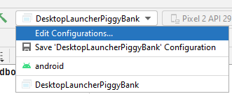
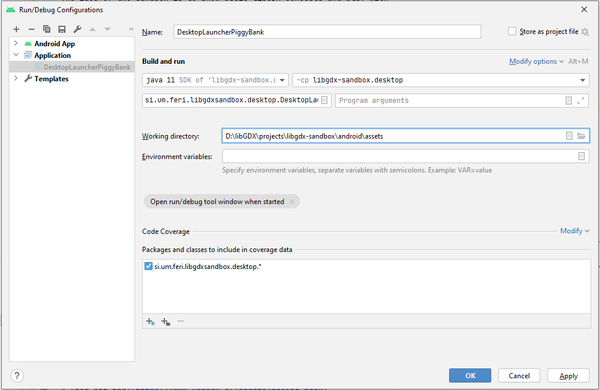

#  sandbox

>*Code is written in Java.*

## Why sandbox?

The idea of the sandbox is to show basic libGDX principles with whose you can play. You can download the code,
run examples and try to change its configuration, and have a better understanding of a specific principle.

## A simple game

The project consists of a simple [Piggy bank game](core/src/si/um/feri/libgdxsandbox/game) whose idea is to
collect as many coins as possible and avoid hammers. The game uses a few different principles without going
into unnecessary details.

## Examples

Each example consists of files with code and a README file. README contains an explanation of the example.

### List of examples within the sandbox:

* [Logging](core/src/si/um/feri/libgdxsandbox/logging)

* [Object pooling](core/src/si/um/feri/libgdxsandbox/pooling)

* [World units](core/src/si/um/feri/libgdxsandbox/units)

* [2D Particle effects](core/src/si/um/feri/libgdxsandbox/particles)

* [Tic Tac Toe game (Scene2d, Game, ScreenAdapter, TextureAtlas, Skin, AssetManager)](core/src/si/um/feri/libgdxsandbox/tictactoe)

* [Ashley](core/src/si/um/feri/libgdxsandbox/ashley)

#### How to run an example:

1. Right-click on the selected DesktopLauncher class.

2. Select `'Run DesktopLaunche....main()'`. This should fail with missing assets because you need to hook
up the assets folder first.

3. Open up Run Configurations.



5. Edit the Run Configuration that was just created by running the desktop project and setting the working
directory to point to the `android/assets` folder.



6. Run application using the run button.

*Summarized instructions from the libGDX page ['Importing & Running a Project'](https://libgdx.com/dev/import-and-running/).*

## TexturePacker

Explanation of `TexturePacker` from [libGDX Wiki](https://github.com/libgdx/libgdx/wiki/Texture-packer#texturepacker):

>In OpenGL, a texture is bound, some drawing is done, another texture is bound, more drawing is done, etc. Binding the texture
>is relatively expensive, so it is ideal to store many smaller images on a larger image, bind the larger texture once, then
>draw portions of it many times. libGDX has a `TexturePacker` class which is a command line application that packs many smaller
>images on to larger images. It stores the locations of the smaller images so they are easily referenced by name in your
>application using the `TextureAtlas` class.

Example on how you can use TexturePacker class you can find in [AssetPacker](desktop/src/si/um/feri/libgdxsandbox/desktop/AssetPacker.java)
class inside desktop project.

Code snippet from the class with arguments of `process` method explained:

```
TexturePacker.process(settings,
        RAW_ASSETS_PATH + "/scene2d",   // the directory containing individual images to be packed
        ASSETS_PATH + "/scene2d",       // the directory where the pack file will be written
        "scene2d"                       // the name of the pack file / atlas name
);  
```

## Assets

List of assets used in the project:

* [black-road.jpg](https://www.freepik.com/free-photo/black-road-texture_946256.htm)

* [red-car.png](https://www.kenney.nl/assets/racing-pack)

* [coin.png](https://www.flaticon.com/premium-icon/coin_2682893?term=coin&page=1&position=2&page=1&position=2&related_id=2682893&origin=search)

* [hammer.png](https://www.flaticon.com/free-icon/hammer_595564?term=hammer&page=1&position=21&page=1&position=21&related_id=595564&origin=search)

* [piggy-bank.png](https://icons8.com/icon/DG65Q7C2voF7/money-box)

* [coin-collect.wav](https://freesound.org/people/bradwesson/sounds/135936/)

* [wreee.wav](https://www.freesoundeffects.com/free-track/wreee-466311/)

* [hole-large-end-alt-locked.png](https://www.kenney.nl/assets/rolling-ball-assets)

* [key.png](https://www.kenney.nl/assets/rolling-ball-assets)

* [star.png](https://www.kenney.nl/assets/rolling-ball-assets)
