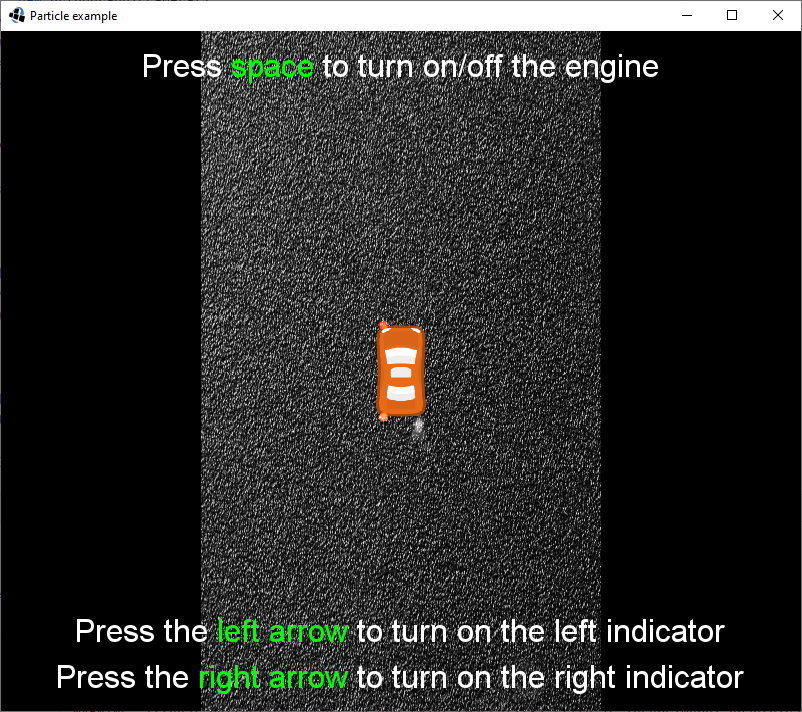

# 2D Particle effects

## How to use an example?

Our example shows the basic usage of particle effects. When you run the example, you can start the car's
engine with `space`, and the smoke particles will begin showing at the position of the car exhaust. If
you press the `left` or `right arrow`, the left or right indicator will start blinking.

## Screenshot

##  Useful resources

* [libGDX Wiki](https://github.com/libgdx/libgdx/wiki/2D-ParticleEffects)

* [2D Particle Editor](https://github.com/libgdx/libgdx/wiki/2D-Particle-Editor)

* [Bachelor thesis: Ribič Matic: Presentation of a particle system in the libGDX framework](https://dk.um.si/IzpisGradiva.php?id=46442&lang=slv)