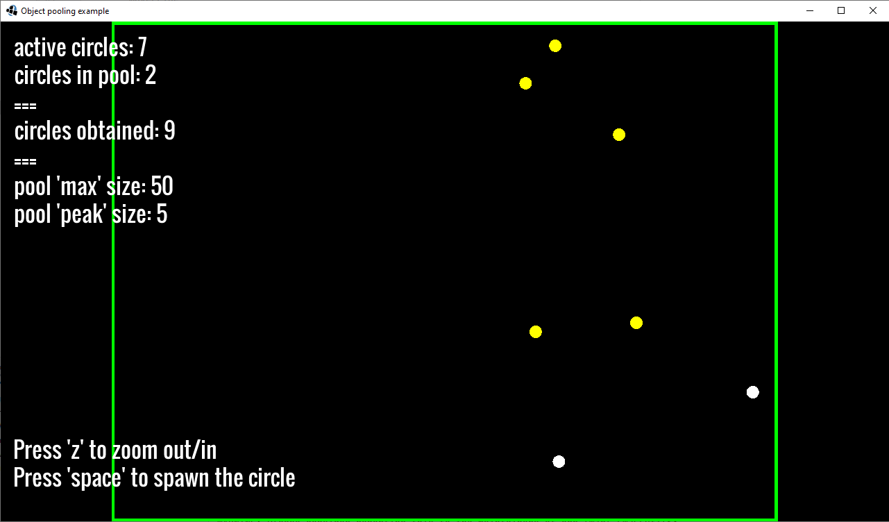

# Object pooling

## What is happening in the example?

Explanation of object pooling principle from libGDX Wiki:

>Object pooling is the principle of reusing inactive or "dead" objects, instead of creating new objects every time.
> This is achieved by creating an object pool, and when you need a new object, you obtain it from that pool. If the
> pool has an available (free) object, it is returned. If the pool is empty, or does not contain free objects, a new
> instance of the object is created and returned. When you no longer need an object, you "free" it, which means it
> is returned to the pool. This way, object allocation memory is reused, and garbage collector is happy.

Our example shows the explanation in action. When you run the example you can see five values printed:

* `active circles`: number of circles that are currently on the screen (that are visible)

* `circles in the pool`: number of circles that are currently held in the pool and ready to be obtained

* `circles obtained`: number of circles that have been obtained from the pool (number of reused objects)

* `pool 'max' size`: the maximum number of circles that can be held in the pool at the same time

* `pool 'peak' size`: the maximum number of circles that have ever been in the pool

You can spawn a circle by pressing `space`. The circle will be yellow if obtained from the pool; otherwise, it will
be white. Try to pay attention to the numbers when spawning circles.

## Screenshot

## Useful resources

* [libGDX Wiki](https://github.com/libgdx/libgdx/wiki/Memory-management#object-pooling)