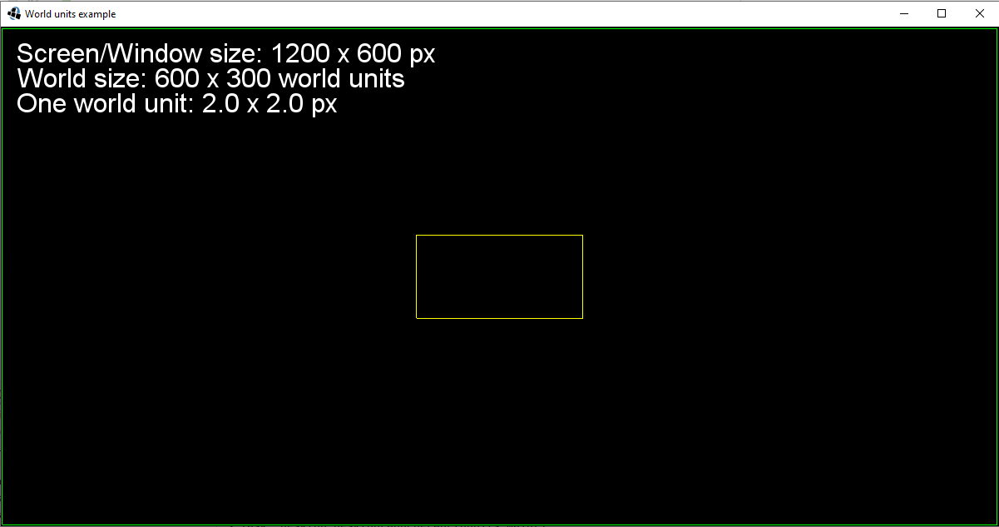

# World units

## What is happening in the example?

The idea of this example is to explain the meaning of world units. The idea behind world units is that you divide
your game world in more logical dimensions for your game. Usually you do not need as many positions in-game as
your dimensions of game world in pixels are. **So you have to forget to think in pixels.** For example, we use
[Viewport](https://github.com/libgdx/libgdx/wiki/Viewports), which handles aspect ratio and manages a camera's
world width and world height. Try resizing the libGDX application and see how values are changing.

#### Example:

```
WINDOW_WIDTH  = 1200 pixels
WINDOW_HEIGHT =  600 pixels
WORLD_WIDTH   =  600 units
WORLD_HEIGHT  =  300 units

PPU_WIDTH  = WINDOW_WIDTH  / WORLD_WIDTH  = 1200 px / 600 units = 2 pixels per unit in width
PPU_HEIGHT = WINDOW_HEIGHT / WORLD_HEIGHT =  600 px / 300 units = 2 pixels per unit in height
```

## Screenshot



## Useful resources

* [The question at the Stack Overflow community](https://stackoverflow.com/questions/51993577/libgdxs-world-units)

* [Question at the Game Development community](https://gamedev.stackexchange.com/questions/70361/libgdx-android-phone-resolution-problem)

* [Question at the Game Development community](https://gamedev.stackexchange.com/questions/151624/libgdx-orthographic-camera-and-world-units)
